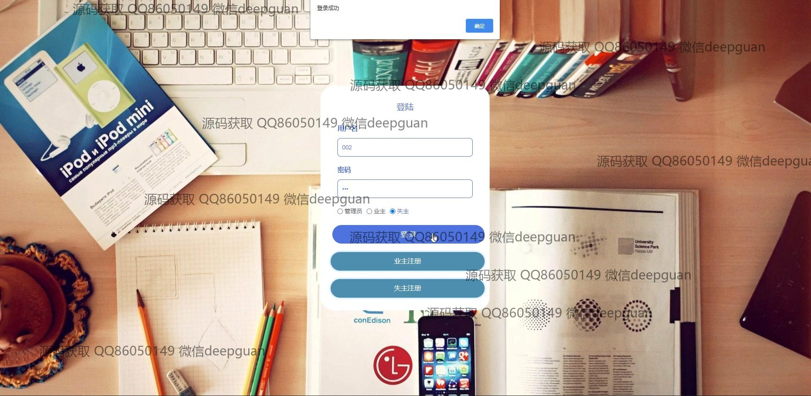

<h1 align="center">的小区失物招领网站</h1>

## 简介
小区失物招领网站：角色分为管理员、业主、失主；支持失物登记和认领、论坛交流、在线投诉、用户管理、物品展示管理等功能，提升社区交流和失物招领效率。    --计算机毕业设计源码；毕设源码；java毕业设计源码

## 联系方式

<h3 align="center">获取完整代码与数据库文件 + 微信：deepguan QQ: 86050149 QQ群: 783742310</h3>

<h3 align="center">可帮忙远程部署 包运行成功！提供远程部署、修改代码、设计文档指导、代码讲解等服务！</h3>

## 功能介绍（完整见运行截图）
管理员：基本功能包括登录、注册和退出；可管理失主与业主的账户信息；负责失物与拾物的展示管理、认领管理、投诉处理以及物品类型与系统配置的管理。网站首页提供主导航栏，与用户互动的公告发布与论坛交流模块，帮助管理社区交流和信息发布。

业主：主要功能是身份验证后可浏览与管理个人中心、失物认领、失物展示和收藏信息；拥有论坛交流权限，可发帖及查看与修改个人账户信息。通过查询和批量操作优化失物认领的便捷性，可参与社区互动与信息共享。

失主：主要功能是管理个人账户和失物信息，包括登记、编辑和上传失物照片；可使用系统提供的工具进行失物查询与认领；通过网站参与论坛交流和在线提交留言或投诉，以便更高效地找回失物并进行社区互动。

用户：网站提供各项注册、登录和身份验证功能；用户（业主/失主）可通过网站首页访问导航栏、失物展示及信息发布模块。用户可参与互动功能如点赞和评论，增进社区沟通，提高失物找回率，并可访问论坛与客服支持功能。

## 运行截图

本代码来源于网络,仅供学习参考使用!

